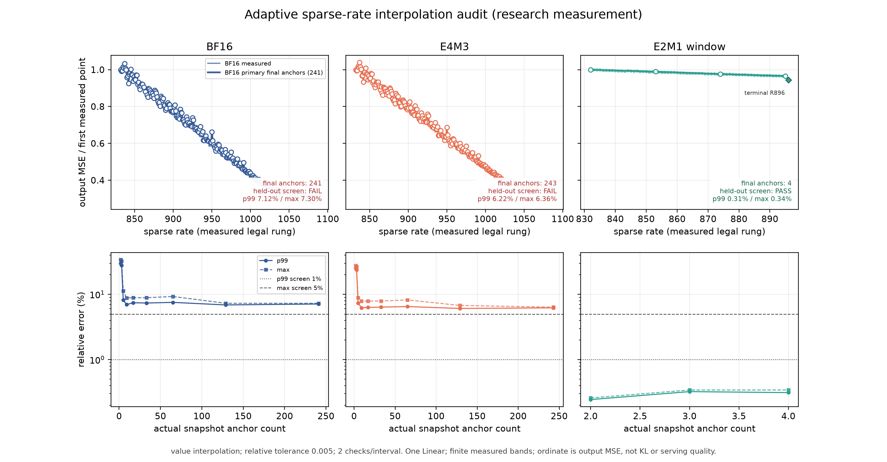

# Complete measured rate bands and adaptive interpolation — 2026-09-11

Sparse piecewise interpolation passed on the measured E2M1 window, but did
**not** provide an accurate sparse replacement for the BF16 or E4M3 curves.
Increasing the anchor budget did not repair the sentinel stopping rule on those
two curves. This is a negative result for this policy on one Linear, not a
proof that every possible rate model must fail.
A later exploratory transfer test passed for E4M3 using the fully measured BF16
curve and two E4M3 endpoints. It offers a candidate reduction across families,
while retaining the cost of measuring the BF16 source curve.

## Workload and scope

All measurements use
`model.language_model.layers.10.mlp.shared_experts.down_proj` (4096 × 2048)
from `GLM-5.3-Flash-BF16`. There are 579 measured rates:

| Family and activation contract | Measured band | Points |
|---|---|---:|
| BF16 K1, BF16 activations | R832–R1088 inclusive | 257 |
| E4M3 K1, dynamic per-token FP8 activations | R832–R1088 inclusive | 257 |
| E2M1 K2 window, static group-16 E2M1 activations | R832–R895 inclusive | 64 |
| E2M1 K2 terminal TCQ recipe | R896, kept separate | 1 |

These are complete **declared bands**, not the complete reader domain. The
terminal recipe is not interpolated with the E2M1 window recipe. Families are
fitted and audited independently. The ordinate is measured
`output_mse_under_route_activation_contract`; it is neither downstream KL nor
joint AURA, a serving latency, or a new serving qualification.

The frozen measurement plans bind the source weight identity, capture and census
hashes, Tessera producer `d403cc5a3199a348cc7ee6262f4adbdab8138745`, and
campaign module SHA-256
`93785e0915ecd7e7e5fdb053f23c3c0182c71566700043b19d1a729790a57266`.
Calibration uses seed 0, 512 samples of length 512, the selected-tensor streaming
path, required Hessians, `max_act_rows=512`, eager attention and TP=1. Every
published curve point has a measured receipt bound to its frozen plan.

Evidence root:
`/mnt/shared/tessera-measurements/glm-canonical-census-20260908/sparse-rate-20260911/`.
The curve files and measurement plans are in `complete-down-curve-01/`.

## Predeclared policy and original result

`adaptive-complete-plan-02.json` froze value/log2 interpolation, relative
sentinel tolerances 0.1%, 0.5%, and 1%, one/two checks per interval, and anchor
caps 2, 3, 5, 9, 17, 33, and 65. The primary policy was value interpolation,
0.5% tolerance and two checks. Acquisition observes only previously revealed
measurements. Fixed widest-gap sampling at the same count and endpoint-only
interpolation are comparators; the audit observes all never-revealed points.
The accuracy screen is p99 relative error ≤1% and maximum ≤5%.

The original primary policy rejected a nonmonotone observation at measurement
12 for both BF16 and E4M3. The last completed nine-anchor snapshots had p99
errors of 6.961% and 6.224%, respectively. These are nine-anchor audits, not
12-anchor final errors. E2M1 stopped at four anchors and passed.

All original results remain under `adaptive-complete-{bf16,e2m1}-01/` and
`adaptive-complete-e4m3-02/`. Original code is reproducible at `f1500e496f`.

## Explicit follow-up: raw reversals and a larger budget

After inspecting the original E4M3 primary result, the follow-up retained raw
positive finite measurements, allowed local reversals, and expanded the budget
to 257 (clamped to the family's legal roster). No smoothing or monotone
projection was applied. The same 12 policy variants and primary policy were
retained. The oracle received the same explicit shape-policy option.

This follow-up was frozen **before root inspected BF16 or E2M1 values or
numerical replay results**, but after the GPU measurements had been collected.
It is an E4M3-informed offline follow-up, not a prospective GPU test or a
family-wide validation. Code: `48b84df099`; plan:
`adaptive-raw-followup-plan-01.json`, SHA-256
`83df299e6114d76d26172d4e3e41daa4651776496eab879ba8bd275677e9359f`.
The inspection boundary is recorded in `adaptive-raw-followup-freeze-01.json`.

[Standalone PDF](figures/adaptive-complete-rate-2026-09-11.pdf). Figure inputs
and outputs are hashed in `adaptive-raw-figures-03/source_hash_manifest.json`.

| Primary policy, raw follow-up | Anchors / measured roster | Never-revealed audit points | p99 error | Maximum error | Screen |
|---|---:|---:|---:|---:|---|
| BF16 | 241 / 257 | 16 | 7.117% | 7.300% | Fail |
| E4M3 | 243 / 257 | 14 | 6.217% | 6.360% | Fail |
| E2M1 window | 4 / 64 | 60 | 0.312% | 0.342% | Pass |

The `empirically_checked` state means the requested sentinels passed. It does
not mean every unseen rate passed: the complete hidden audit above exposes
that distinction. More anchors can remove easy points from the audit while
leaving a few difficult ones, so p99 need not fall monotonically with count.
A full-roster run has no unseen points and reports an empty audit, not a pass.

E2M1's endpoint-only value interpolation already passed on this band: p99
0.244% and maximum 0.258% over 62 unseen points. Thus four anchors are the
primary algorithm's count, not a claim that four are necessary. Adding the two
checks did not improve its error here. This result still needs another Linear
before it can support a transferable measurement-saving policy.

## How many anchors can an ideal piecewise model use?

The offline dynamic program knows all measured values and finds the exact
minimum number of anchors for its interpolation mode and a **maximum-error**
bound on the finite roster. This is a diagnostic compression bound; it cannot
choose those anchors without access to the complete curve. Its maximum-error
criterion is stricter than the study's p99/maximum screen and must not be
presented as the same optimization problem.

| Maximum relative error bound | BF16, value PWL | E4M3, value PWL | E2M1 window, value PWL |
|---|---:|---:|---:|
| 0.1% | 250 / 257 | 251 / 257 | 19 / 64 |
| 0.5% | 210 / 257 | 207 / 257 | 2 / 64 |
| 1% | 164 / 257 | 159 / 257 | 2 / 64 |

Log2 PWL needs 164, 158 and 2 anchors at the 1% maximum bound. Its small
advantage on E4M3 does not establish a useful sparse acquisition policy.
Results and profiles are under `adaptive-raw-{bf16,e4m3,e2m1}-01/`, with
`offline-oracle/report.json` for each oracle.

## Source structure and exploratory family transfer

At the pinned producer, `bresenham_rate_schedule` mixes the two adjacent
integer column rates with an exact quota (`src/tessera/grammar.py:279–327`).
For these 2,048-column K1 curves, one q256 step adds eight upper-rate columns
in total but can reassign many existing columns. LDLQ then propagates block
residuals and refits a shared scale plane (`src/tessera/encode.py:3352–3421`).
The effect is source dependent; a small integer phase is not the complete
state of the encoder.

The measured BF16/E4M3 local signed residuals have Pearson correlation 0.98853,
with 19 of the 20 roughest rates in common. Simple phase, period and schedule
churn summaries do not explain the magnitude of the remaining deviations.
This supports a shared source/schedule explanation, without isolating LDL,
refit, or other contributions. Source inspection and CPU diagnostics are in
`source-curve-diagnosis-01/`; PB action `5bbd64d467a2…` completed successfully.
No component ablation or second-unit validation was performed.

After inspecting that correlation, two endpoint-exact transfer forms were
evaluated. Both use **all 257 measured BF16 values**, and fit only E4M3's two
endpoint values. The other 255 E4M3 measurements are scoring truth:

| Exploratory transfer form | E4M3 p99 error | Maximum error | Screen |
|---|---:|---:|---|
| BF16 plus a rate-linear endpoint difference | 0.772% | 0.823% | Pass |
| `E4M3(q) = alpha + beta * BF16(q)`, endpoint-solved | 0.745% | 0.814% | Pass |

Neither form fits on an interior E4M3 target, but the decision to test transfer
was made after full-curve inspection. This is an exploratory reuse result,
separate from the frozen family-independent study. It does not solve sparse
BF16 acquisition or prove transfer to another Linear.

Combining the measured BF16 source (257), two E4M3 endpoints, two E2M1 window
endpoints and one E2M1 terminal gives a **262-measurement candidate versus the
579-point reference** on this Linear. That is a replay-based count, not an
observed campaign-time or energy saving. A second unit selected in advance
must validate the same two fixed transfer forms before this becomes a general
policy. The proposed larger reconstruction-proxy experiment was not run.

The complete source, predictions, input hashes, cProfile and verified PB
receipt are retained in `paired-family-transfer-01/`. Action
`ba81dd454b1d0e54dfaf9c62ad89c4e6207f48a15b8b29f46de9a0b0c1356125`
completed on dl380g10 with exit zero. No serving/default changes follow from
this result.

## Cost and validation

The CPU query benchmark is reported separately in
[adaptive-rate-query-cost-2026-09-11.md](adaptive-rate-query-cost-2026-09-11.md).
On its synthetic matched-anchor workload, adaptive log2 queries took roughly
2–3 microseconds for 2–65 anchors. That timing does not establish sparse
accuracy, and it does not cover the 241/243-anchor results above. GPU
measurement cost and CPU lookup cost are different costs.

All non-vLLM tests, measurements, collection and replay ran through
PrismaBuild. The integrated raw-policy/core/oracle/docs checks passed 80 tests
on CPU (`84a80b750225a535663ae1031c0016c3dc0bdd911db9402c0ffd070da8217355`),
with 14 existing Torch deprecation warnings and no skips. The new behavior
first failed against the original core (`a4874e111cc8…`, unsupported policy
argument), then passed after integration. Earlier original-study/campaign
validation and its skips remain recorded in the initial verification files;
counts from overlapping reruns are not added together.

Resource evidence is retained in each PB ending. The E4M3 outer-launcher Nsys
trace contains no CUDA kernel events and is unusable for attributing GPU time.
It remains negative profiling evidence. No GPU speedup or GPU bottleneck
attribution is claimed from that trace or from utilization percentages.

`complete-down-curve-01/resource-summary-01.{json,md}` reconciles the seven
encoding attempts to 579 new durable anchors, excluding recovery adoption.
All seven termination records report successful cleanup. BF16's final recovery
took 3,133.6 s for 196 new anchors; E4M3's two attempts took 1,508.7 s for 169
and 944.4 s for 88; E2M1's recovery took 3,437.4 s for 63. These include setup
and publication and are not isolated per-family timing comparisons. BF16 and
E2M1 overlapped on Sparky. Mean whole-box power in those windows was about
33 W; the E4M3 windows on Lina averaged 26.9 and 23.7 W against the 140 W
reference. Their estimated energies are not attributable to individual jobs
and must not be added across overlapping windows. The existing dense anchor
batching limitation is recorded on PrismaQuant #283; no unmeasured batching
speedup is claimed.

Two PB defects encountered in this session were fixed separately: the metrics
reader could exceed its memory cap while reading a large terminal record
(PR #512), and a windowed profiler imposed an undocumented 900-second action
lifetime (PR #516). The Docker/Nsys instrumentation gap was recorded in #513
and fixed independently by PB PR #515. The original records and interrupted
attempts were retained; supported recovery adopted durable anchors.

Verification records include `adaptive-raw-complete-verified-01.json` (52 CPU
actions), `adaptive-final-root-verification-01.json` (all three curve/point
receipt sets, primary/oracle report bindings, profiles, collector and tests),
and `resource-summary-root-checks-01.json`. The separate terminal-point
verification is in `adaptive-terminal-benchmark-artifacts-verified-01.json`.
Both original and follow-up campaign manifests are retained beside the plans.

The practical result is to retain measured production prices under this
contract, with E2M1 endpoint interpolation and paired BF16→E4M3 reuse as bounded
research candidates. No production format menu, allocator default, exporter
or serving gate changed.

## Follow-up completed — 2026-09-12 UTC

The [prospective layer-20 study](prospective-family-transfer-2026-09-11.md)
fixed these paired-family forms before acquisition and sealed each prediction
set before measuring its target interior. Both E4M3 forms and E2M1 endpoint
interpolation passed the original screen on that second shared-down Linear.
Primary E4M3 error was 0.534% p99 / 0.666% maximum; E2M1 was 0.952% / 1.093%.
This adds prospective evidence while retaining the full BF16 source curve and
the research-only limits above.
