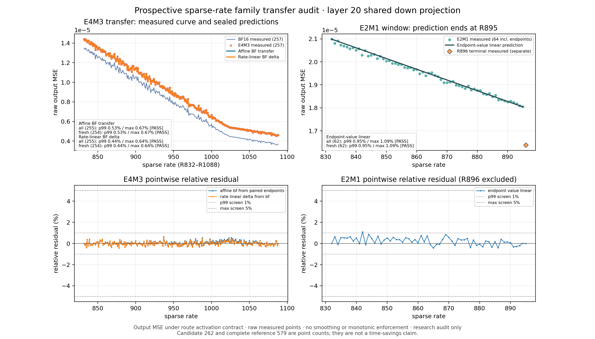

# Prospective family transfer on GLM layer 20

The fixed paired-family prediction rules passed the prospective layer-20
screen. E4M3's primary rule achieved 0.534% p99 and 0.666% maximum relative
scalar-MSE error; E2M1 endpoint interpolation achieved 0.952% and 1.093%.
The candidate uses 262 measured points against this study's 579-point reference,
but still requires all 257 BF16 source points. This supports transfer on a
second Linear; it does not establish a model-wide policy or a runtime saving.
Study started 2026-09-11; acquisition and audits completed 2026-09-12 UTC.

The first complete-band study found that a fully measured BF16 reconstruction
curve plus two E4M3 endpoints could predict the E4M3 interior on layer 10.
That was a post-hoc result. This study fixes those rules before acquiring a
second dense curve, then seals each family's predictions before acquiring its
target interior. It tests the scalar prediction rule, not serving quality,
prefill latency, or a production allocation policy.

## Fixed target and acquisition order

The target is `model.language_model.layers.20.mlp.shared_experts.down_proj`,
shape 4096 × 2048, on GLM-5.3-Flash. Source weights, Tessera producer, canonical
calibration, production rendering and activation contracts match the layer-10
[complete-band study](adaptive-complete-rate-curves-2026-09-11.md).

Eight measurement plans partition the 579-point reference without repeating
endpoints inside this study:

| Piece | Rates, inclusive | Measurements | Prerequisite |
|---|---|---:|---|
| BF16 source | 832–1088 | 257 | Frozen preselection |
| E4M3 left and right endpoints | 832; 1088 | 2 | Frozen preselection |
| E4M3 target interior | 833–1087 | 255 | E4M3 prediction seal |
| E2M1 left and right endpoints | 832; 895 | 2 | Frozen preselection |
| E2M1 target interior | 833–894 | 62 | E2M1 prediction seal |
| E2M1 terminal | 896 | 1 | Frozen preselection |

The six initial actions supply 262 measured points. The two complementary
interior actions supply 317 audit points. E2M1's audit can overlap BF16 source
acquisition; E4M3 predictions require the full BF16 source first. Each target
interior action declares its prediction seal as a bound input to PrismaBuild.
These counts do not establish a wall-time or energy reduction.

## Rules and prior exposure

For E4M3, the primary rule is `alpha + beta * BF(r)`, with both coefficients
solved from the paired family values at R832 and R1088. The fixed secondary
rule adds a rate-linear interpolation of the two endpoint E4M3-minus-BF16
differences to `BF(r)`. E2M1 uses value-linear interpolation between R832 and
R895. R896 is a separately measured terminal, outside the interpolation span.
No coefficients or rules are refitted from the target interiors.

Each form is scored separately using absolute relative scalar MSE error:
`abs(prediction / measurement - 1)`. The declared screen requires complete
finite positive predictions, p99 error at most 1%, and maximum error at most
5%. Empty audits cannot pass. Exact measured endpoints are preserved and
excluded from interior accuracy metrics.

Layer 20 appeared in the earlier sparse study's development set. Its prior
BF16 and E4M3 observations were R832, R960 and R1088; E2M1 had R896 only.
This exposure inventory used rate availability without inspecting numerical
costs for the new selection. Consequently, the E4M3 report includes both all
255 interior rates and the 254 rates absent from that historical dataset.
E2M1 has 62 interior rates in both views. The unit itself is not wholly
unexposed, and one new dense curve cannot qualify a family-wide policy.

## Measured result



[Standalone PDF](figures/prospective-family-transfer-2026-09-11.pdf).
The [artifact snapshot](artifacts/prospective-family-transfer-2026-09-11/)
contains the eight measured curve pieces, both protocols, seals and audits,
preselection, and input/output hash manifests. The renderer completed in PB
action `533db605b96d8b752a906fb5e57441f485f44c3ba040c0766d35d1cf981cdb1a`
on DL380 (CPU1, 2 GiB, return code 0). Its tested snapshot matched the
committed renderer; all 15 input hashes and both outputs were verified, and
the PNG was visually inspected. Raw measurements are retained
without smoothing or monotonic enforcement.

| Fixed form | Audit | Interior points | Mean error | p99 error | Maximum error | Screen |
|---|---|---:|---:|---:|---:|---|
| E4M3 affine BF transfer, primary | All | 255 | 0.1567% | 0.5337% | 0.6657% | Pass |
| E4M3 affine BF transfer, primary | Historically unmeasured rates | 254 | 0.1569% | 0.5337% | 0.6657% | Pass |
| E4M3 rate-linear BF delta, secondary | All | 255 | 0.1460% | 0.4379% | 0.6382% | Pass |
| E4M3 rate-linear BF delta, secondary | Historically unmeasured rates | 254 | 0.1459% | 0.4381% | 0.6382% | Pass |
| E2M1 endpoint-value linear | All / historically unmeasured rates | 62 | 0.3459% | 0.9521% | 1.0929% | Pass |

E4M3's endpoint-solved primary coefficients were
`alpha=9.503680946998211e-7`, `beta=0.996641682116494`.
The secondary form performed slightly better here; it remains the secondary
form and was not chosen after seeing the audit. E2M1's separately measured
R896 terminal had output MSE `1.6379603039240465e-5`; it has no interpolated
prediction and is excluded from the accuracy table.

The frozen rule therefore reproduces the earlier exploratory finding on a
second dense curve. The practical candidate is to measure BF16 completely,
measure two E4M3 endpoints and two E2M1 window endpoints, and measure the E2M1
terminal separately. It does not solve sparse BF16 acquisition. The study
measured all 579 points to evaluate that candidate; its 262-point input count
is not an observed reduction in GPU time or energy. The two tested Linears are
shared-expert down projections in the same model. Routed experts, other
projection roles, other models, wider rate bands, downstream KL, joint AURA
allocation, and served prefill remain unqualified by this result.

## Frozen evidence

The shared artifact root is
`/mnt/shared/tessera-measurements/glm-canonical-census-20260908/sparse-rate-20260911/prospective-shared-down-l20-01/`.

`preselection-01.json` fixes the target, eight plan hashes, formulas, screens,
exposure ledger and dependencies. It was written at Unix time
`1789169596.9625409`, before the initial GPU submissions, with SHA256
`2504bd45047e14d534304c9d269896efa18942f3b27dbd6643ce40b2bcd41c1c`.
The generalized evaluator is reviewed, tested and frozen before opening the
new numerical inputs. This implementation freeze is distinct from the
earlier freeze of the study's mathematical choices.

Historical dataset SHA256:
`3547254ab482ed60f20ec738d2aaae23c2d2ca82cb2b9a53fddf756f52df855e`.

GPU work uses PrismaBuild's existing production campaign and cache paths in
the known-good container. CPU collection, prediction sealing and audits also
run through PrismaBuild. Resource reports and host telemetry establish the
observed execution envelope; this study does not claim an encoder speedup or
infer a GPU bottleneck from utilization percentage.

## Provenance repair and validation

The frozen E4M3 endpoint plans retained an audit-region label for R1016–R1032,
which lies outside either singleton's legal rate roster. The collector refused
both plans after the endpoint GPU measurements succeeded. Their original
measurement plans, point measurements and request hashes remain unchanged.
A strictly bound correction sidecar records the deterministic intersection of
each audit region with the legal roster; the empty label is retained. The
collector and curve validator both verify that intersection. The corrected
collectors succeeded without repeating GPU work.

The E2M1 protocol uses the implementation frozen at `63a8f9ee7c`; its prediction
seal was completed before the E2M1 interior request was published. The E4M3
protocol uses `8e1375949b`, which includes the annotation repair and binds the
correction helper's implementation hash. It was frozen before opening the new
E4M3 numerical inputs. Both retain the same original preselection, mathematical
rules and acquisition plans.

The prospective evaluator's committed-source validation passed 74 tests in PB
action `cf5948c4a5376a4e57f9b10e15604373d4f8a73e235f5f3ec89eb55345c3b29e`.
The subsequent annotation repair's final validation passed 81 tests in three
independent groups (42 collector/adaptive, 20 protocol, 19 architecture/docs):
`61b88006b5c19f6cdf1c98cfb3b2224abca92472364df944c0ddfe5acf2cd158`,
`2495713b218f224dd0d10dc4ceac2d8e9a63a7d888dbee64e4837d6b56a195a2`, and
`ed1993676d1ef0a3bfd91dc3c57d8a625943be3f6c7f8980b9a73db96ddbc9ba`.
These CPU checks ran on DL380 through PB, with one CPU and 2 GiB per action,
bounded native threads, no skips, and existing Torch deprecation warnings.
CAS payloads and the tested Git snapshots were checked against the committed
source. Counts from overlapping validation runs are not added together.

## Completion and reproduction

All eight GPU actions completed with return code 0 and cover exactly 579
measured family/rate points. The final E4M3 interior GPU action was
`54af7a7409cf5489a60601bdc5e74f661796266a739c4a75955d899989a07385`;
its collector was
`c0985ad926974fa54b08281aa5542a68e86279a60943e6615fb48463fe117913`.
Every curve's plan, point-receipt roster and hashes were checked, together with
actual terminal return codes and canonical CAS receipts/payloads.

| Operation | PB action | Result artifact |
|---|---|---|
| E2M1 prediction seal | `810689a52cbbff995e30bceed8738d63b95be3d00c798771cd9f0e9563a5c2ca` | `e2-seal-01.json` |
| E4M3 prediction seal | `d138a631c049d469e86b0c4244969fbdf5420cde1b28c466db0c7e202afb400b` | `e4-seal-01.json` |
| E2M1 final audit | `fd856c3c6b1cf1a42b93a64875d249c561466e2ac94b97b4e93e13e2d0722ef1` | `e2-audit-01.json` |
| E4M3 final audit | `66b0199ee2b4f56020ace8fcd4b7cbda812df2dfc1378faefed6a6a684770699` | `e4-audit-01.json` |

Both audits ran on DL380 with one CPU, 2 GiB and native thread limits of one.
E4M3 audit SHA256 is
`e5c355b8d7543b754cc3a7fa78377f50bf92bc1a6d452576151c6003ab940257`.
The root verification records in the shared artifact directory preserve the
seal-before-acquisition ordering and audit-to-protocol/curve bindings.
The `l20_shared_down_*.pb-campaign.json` submissions and their
`*.data-manifest.json` inputs preserve the acquisition and collection commands.

To repeat the E4M3 audit, use the implementation frozen at `8e1375949b` and
submit the following child command through `pbrun.py`, binding
`e4-audit-01.data-manifest.json`; choose a new output filename because the
protocol refuses overwrites. E2M1 uses `63a8f9ee7c` and its corresponding
protocol, seal, sources and targets.

```bash
/home/rob/venvs/pq-cpu312/bin/python -m experiments.sparse_rate_family_transfer audit \
  --protocol "$STUDY/protocol-e4-01.json" \
  --seal "$STUDY/e4-seal-01.json" \
  --sources "$STUDY/e4-inputs-01.json" \
  --targets "$STUDY/e4-targets-01.json" \
  --out "$STUDY/e4-audit-repeat.json"
```

Here `STUDY` is the shared artifact directory above. The figure renderer is
`experiments/plot_sparse_rate_family_transfer.py`; its PB command uses
`--artifact-dir "$STUDY" --out "$STUDY/figure-01"`.

PB resource profiles and `/proc` I/O evidence accompany the completed actions.
Netdata observations from both GB10 hosts are retained in
`steady-resource-view-{01,02}.json` and
`steady-resource-view-03-e4-interior.json`. In the latter interval, Sparky's
GPU power averaged 32.9 W and peaked at 38 W against its approximate 140 W
envelope, while Sparklina averaged 3.1 W. PB had one claimed action and no
ready work. These are box-level observations, not action-attributed energy or
proof of an encoder bottleneck. No before/after performance change is claimed.
The limited work granularity is recorded in
[PB #517](https://github.com/RobTand/prismabuild/issues/517), with Rob's approved
pre-execution decomposition design in
[PR #518](https://github.com/RobTand/prismabuild/pull/518), handed to Claude for
implementation. The running study was completed with its original immutable
work units.
